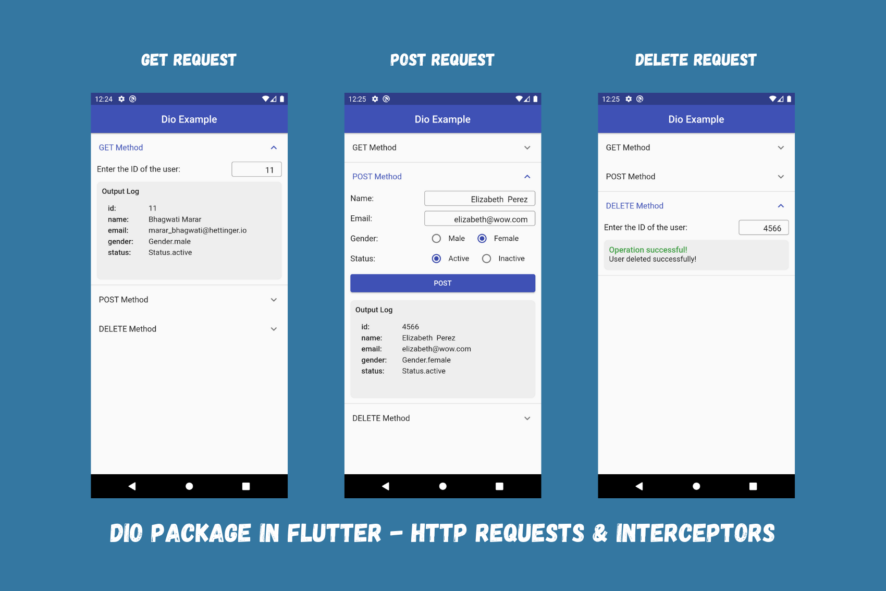

# Flutter Dio Example

[Dio](https://pub.dev/packages/dio) Package in Flutter - HTTP Requests and Interceptors. Learn how to use Flutter Dio package to make http requests, deal with interceptors and take care of unexpected server responses and failures in Flutter apps.

This project shows - 
- how to work with code generation libraries to create robust model classes.
- how to initialise dio package.
- how to make http requests using dio package.
- how to handle server errors and network issues using custom exception handler.
- how to work with interceptors and logger for better logging purposes.
- how to connect UI using FutureBuilder for asynchronous methods.

### Read the article [here on Medium](https://medium.com/@thecodexhubofficial/dio-package-in-flutter-http-requests-and-interceptors-2c3d6ef3e9a3).

<!-- ### Check the sample video [here on Instagram](https://www.instagram.com/p/CXwDnyZjyGx/?utm_source=ig_web_copy_link). -->

## Preview

## Getting Started

For help getting started with Flutter, view our
[online documentation](https://flutter.dev/docs), which offers tutorials,
samples, guidance on mobile development, and a full API reference.

### If you like this repository, kindly give it a star ⭐
